<h1>File Integrity Monitor</h1>
This project outlines a demo of a File Integrity Monitor program using PowerShell ISE. 

<h2>How to:</h2>
Monitor File Integrity

<h2>Environments and Technologies Used</h2>

- PowerShell ISE

<h2>Operating Systems Used </h2>

- Windows 10

<h2>Stages</h2>

- Setup
- Baseline
- Monitoring
- Hash

<h2>Steps</h2>

<h2>Stage 1: Setup</h2>

Step 1: Temporarily allow script execution for the session.

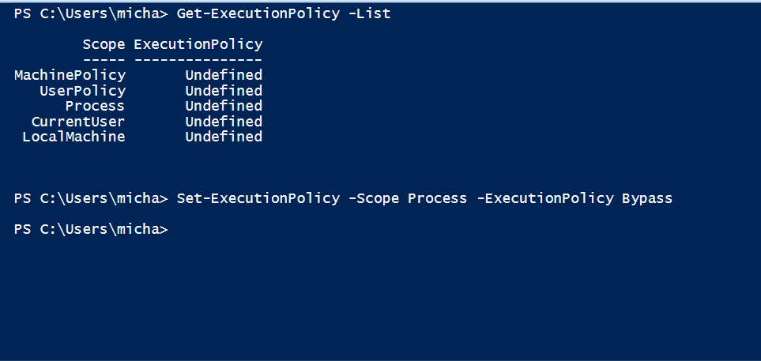

Step 2: Here is the Files folder we will be monitoring.

Step 3: Next, we run the custom script. (Found here: https://github.com/joshmadakor1/PowerShell-Integrity-FIM/blob/main/Fim.ps1)

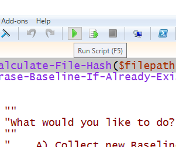

 

<h2>Stage 2: Baseline</h2>

Step 4: Establish a new baseline on the files in the Files folder.

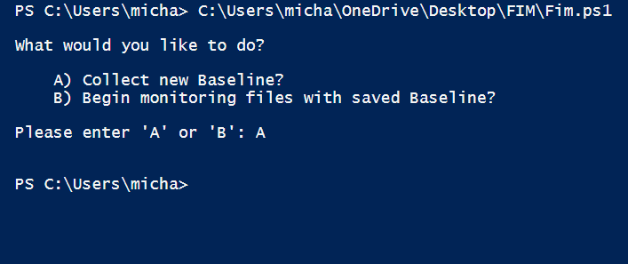

Step 5: Baseline file created. 

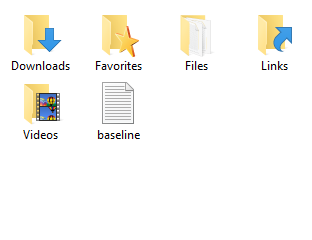

Step 6: File hashes of the four .txt files contained in the Files folder.

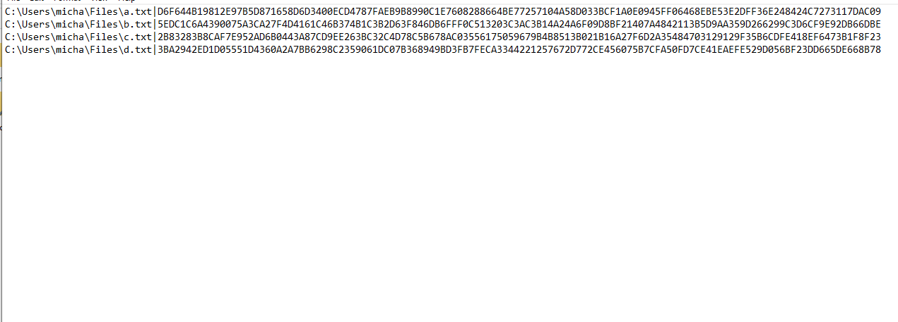

 

<h2>Stage 3: Monitoring</h2>

Step 7: Begin monitoring files using saved Baseline.

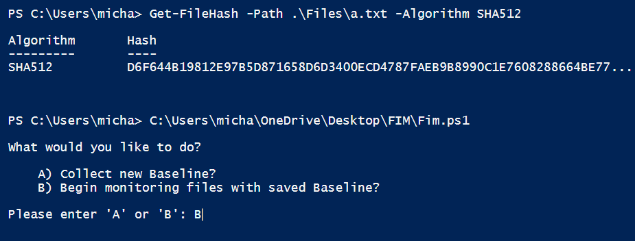

Step 8: After removing one of the files from the folder, we see that we get an alert that the file a.txt has been deleted.

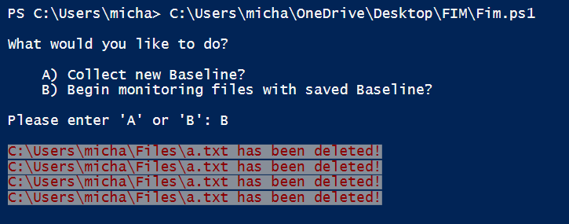

Step 9: Then, I put the a.txt file back, but modified it by adding a new character, which the FIM detected and alerted us that the file had been changed.

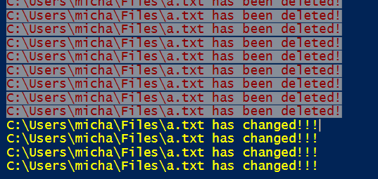

Step 10: I then added a new file called e.txt to the Files folder and received an alert that a new file had been created.

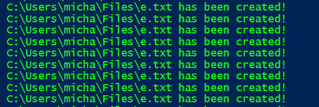

 

<h2>Stage 4: Hash</h2>

Step 11: After returning the Files folder back to its original state, I output the SHA512 hash for the a.txt file.

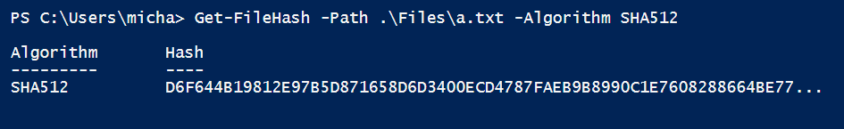

Step 12: By running the above command, I displayed the entire hash value.

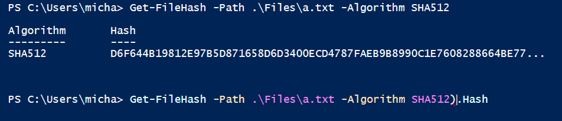

Step 13: Here we see the full hash of a.txt.

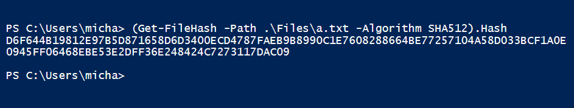

Step 14: Here I just added an additional a to the a.txt file.

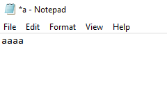

Step 15: And by running the same command as before, we can see that the file a.txt has a completely different hash since adding only 1 letter.

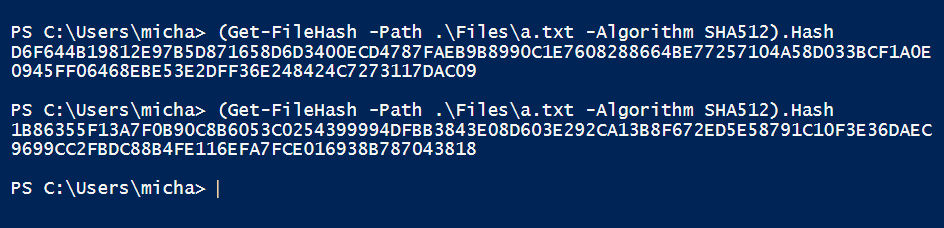

 
